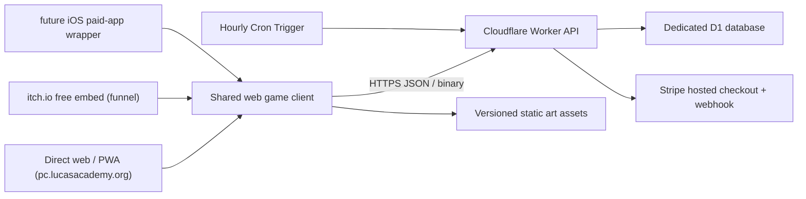

# 架构与托管方案

## 结论

MVP 推荐使用 Cloudflare 静态托管/Worker Assets + Worker API + 独立 D1。因为默认玩法已经变成异步链接挑战，不需要常驻 Node 服务、公开匹配或 WebSocket，Render 在这一阶段没有必要。

“独立 D1”指在 Lucas Academy 使用的同一个 Cloudflare 账户中创建 `painterly-chameleon-prod`，而不是在 Academy 的现有数据库里增加表。免费额度按账户合计，但数据库可以隔离。

## 系统边界



发行范围由 [DECISIONS.md](DECISIONS.md) D-015 固定：网页 + itch 免费引流 + Apple 付费 App；不上 CrazyGames/Poki/Discord/Facebook/Steam。

### 共享游戏核心

共享以下内容：

- 场景渲染、输入、碰撞和计时。
- Hider 编辑和 Seeker 寻找规则。
- 艺术房间 manifest 和资产加载。
- 挑战 payload 编解码。
- 响应式手机布局。

平台差异必须放在适配器中：

- 身份：匿名网页会话、Discord 用户、门户访客。
- 支付：直接网页、Discord SKU、itch.io 购买凭证或无支付。
- 分享：Web Share API、复制链接、Discord channel context。
- 生命周期：顶层网页或 iframe 暂停/恢复。

### 客户端呈现边界（2026-07-19 起为 "everything on canvas"）

创建与寻找两个 **play 视图**由 `GameCanvas` 全权绘制：房间经相机变换 contain-fit 进全屏画布，wordmark、HUD、joystick、Close Look、按钮和 ready/result 覆盖层都画在画布上（命中区在屏幕 CSS 像素空间重建）。保留 DOM 的部分：绘画工作室、举报面板、登录/分享/解锁 `<dialog>`、语言 `<select>`（浮于画布右上）、加载覆盖层、Turnstile 槽位和可访问性文本。Lobby/admin 仍是常规 DOM 页面。

- 960×640 逻辑世界与 challenge 坐标不因 viewport 改变；viewport 只影响相机缩放。
- 命中检测依赖 `getBoundingClientRect()` == 绘制区域；不用 `object-fit` 信箱式缩放。
- 未来 iOS 包壳复用同一客户端，只替换外围能力（购买入口消失，见 D-015）。

### 嵌入平台的 API 会话

直接网页可以继续使用同源 `/api` 和签名 HttpOnly cookie。第三方托管或 iframe build 不能假设同源路径和第三方 cookie 可用，应使用：

1. 平台适配器确定可信 build target 和 API origin。
2. 平台 identity token 由 Worker 向平台服务端验证；匿名入口则领取短期、受限的 bearer session。
3. Worker 用显式 origin allowlist/CORS 和 Authorization header 接收请求。
4. 限流与 entitlement 使用服务端验证后的内部 subject，不直接信任客户端 platform user ID。

这只是传输和身份适配，挑战、D1、TTL、举报和 entitlement 后端仍然统一。

## 为什么不需要 WebSocket

MVP 中的状态转换都是请求/响应：

1. Hider 发布不可变挑战。
2. Seeker 在任意时间读取挑战。
3. Seeker 提交一次结果。
4. Hider 读取聚合结果。

没有必须广播的实时状态。WebSocket 会增加连接恢复、房间清理、扩容和平台代理兼容成本，却不改善这个循环。

只有未来明确实现“所有 Seeker 同时开始、彼此可见或实时比分”的 Party 模式时，才重新评估 Durable Objects 或 Render 上的实时服务。异步模式即使加入实时模式后也应保持独立可用。

## HTTP API（实际路由以 `src/worker.js` 为唯一事实来源）

```text
GET    /api/health · /api/config（含 turnstile 与 products 目录）
GET    /api/explore[?q=]           24 小时公开挑战 feed / 两词名前缀搜索
POST   /api/challenges             发布（登录门 + 解锁门在此强制）
GET/DELETE /api/challenges/:token  读取（硬过期 410）/ Hider 删除
POST   /api/challenges/:token/attempts
POST   /api/reports                固定原因举报
POST   /api/auth/request-otp · verify-otp · logout；GET /api/auth/me
GET    /api/account/challenges · /api/account/entitlements
POST   /api/checkout               建 Stripe 托管结账 session
POST   /api/webhooks/stripe        验签 → 写/撤销 bundle:all-houses 权益
POST   /api/dev/grant-entitlement  仅 localhost（本地测付费流）
```

读取挑战时必须先判断 `expires_at <= now`。已过期就返回 `410 Gone`，不能等待 Cron 删除后才失效。

## 数据放在哪里

### 静态资源

以下内容随版本部署到静态托管/CDN：

- 房间背景和碰撞信息。
- 角色基础图、画笔纹理、音频和本地化文案。
- 房间 manifest 和资产来源构建产物。

它们不应进入 D1，也不应为每个挑战重复存储。

### D1

D1 只保存：

- 24 小时挑战 payload。
- 独立 Seeker 尝试及挑战汇总。
- 默认加入 Explore 的挑战额外保存可公开的 invitation token；Hider 取消勾选后的私人挑战仍只保存 token 哈希。
- 持久的购买、退款和房间权益。
- 已启用的内部 account、邮箱/未来平台 identity、短期 OTP、哈希 session 和有限公开挑战索引。
- 最小化的滥用举报和匿名日指标。

当前客户端把 192×192 的透明角色缩到 128×128 有损 WebP（不支持时回退 PNG）。每挑战另存两张小图：`preview_image`（唯一公开缩略图，客户端已模糊化，160×107 ≈ 2 KB，上限 14 KB）和 `last_found_image`（找到时刻截图，仅 Hider 可见，400×267，上限 60 KB）。完整 JSON 请求上限约 160 KB。具体常量以 `src/core.js` 为准。房间背景和家具只作为 CDN 静态资源发送，不进入每个挑战。

压缩后的实际大小必须通过 playtest 采样，而不是用上限做成本预测。即使达到上限，24 小时 TTL 也会把存储量绑定到“过去一天发布量”，不会随累计用户无限增长。

当活跃挑战 payload 总量接近 100–150 MB、P95 单挑战显著偏大、或要保存回放/视频时，再评估 R2，D1 只留对象键和元数据。MVP 不提前增加 R2。

## 身份和邀请

- Seeker 默认匿名，不创建账户。
- 邀请 token 至少 128 位随机熵，不使用递增 ID。
- 数据库尽量只存 token 的哈希；URL 中的原始 token 只交给参与者。
- Hider 用短期签名会话管理和删除自己的挑战。
- 恢复永久购买需要成人购买者身份；它与匿名 Seeker 流程分开。
- 挑战名只能使用审核词库生成的两词英文组合；不接受用户输入的自由文本挑战名、聊天内容或公开用户名。
- 永久身份使用内部 `account_id`；邮箱和平台用户 ID 只作为可验证、可关联的 provider identity。
- 当前受控验证默认把首页匿名 Hider 的 Van Gogh 24 小时挑战加入 Explore，并提供明确的私人链接取消选项；Explore 发起创作及 Monet、Outdoor、Color Rebirth、The Tide Dreams in Starlight 已要求账户，跨设备挑战管理和长期公开仍留在后续阶段。

## Explore 缓存与 D1 读取

`GET /api/explore` 只查询最多 60 个仍有效的公开挑战及其聚合尝试，不读取 `payload_json`、base64 角色图或房间资产。`GET /api/explore?q=` 对规范化的 `room_name_search` 做索引前缀范围查询，最多返回 12 条，同样不读取 payload。Worker Cache API 内部缓存完整 feed 和每个规范化搜索 60 秒；对浏览器返回的包装响应强制 `Cache-Control: private, no-store`，避免 Cloudflare 账户级 4 小时 Browser Cache TTL 覆盖较小的 `max-age`。公开挑战创建或删除时清除当前节点的主 feed；搜索允许最多 60 秒短暂延迟。

Cloudflare Cache API 按数据中心分布，不是全局单例，所以不能承诺全世界每 60 秒只读一次 D1。其成本边界仍然清楚：同一边缘节点的重复浏览命中缓存，缓存未命中才执行一次有限候选查询；其他节点最多延迟一个 TTL 看到增删变化。

## 支付与权益

游戏核心只认识内部权益（`entitlements` 表里的 `bundle:all-houses`），不认识支付渠道。渠道以薄适配层接入，全部落到同一张表：

- **网页 Stripe（已实现）**：`POST /api/checkout` 建托管结账 session；`POST /api/webhooks/stripe` 验签后幂等写入权益（按 `payment_intent` 为 `source_reference`），`charge.refunded` 反写 refunded。密钥只在 Worker secrets。
- **Apple 付费 App（计划，见 D-015）**：$2.99 买断、无 IAP，App 内无购买流程；"已购 App"到服务端权益的映射在开工时定。
- `UNIQUE(source_provider, source_reference)` 保证每笔支付只授权一次；本地用 `POST /api/dev/grant-entitlement` 测流程。

挑战发布时把授权使用的 `art_house_id` 固化在挑战中。Seeker 访问邀请时验证的是挑战授权，不是 Seeker 自己的购买记录（来找永远免费）。

## 活画/粒子特效的性能路径（loader 与 6A–6C 全屏背景已用）

现状（loader，SVG 实现）：动画笔触上的 `feGaussianBlur` 或大面积 `feTurbulence` 是最大杀手——滤镜内容每帧变会每帧重新栅格化，还可能暴露滤镜的长方形表面。Loader 因而保持为 68–96px 的小型 spinner，用 5 块带静态径向渐变的有机 SVG 色块模拟湿颜料在象牙底上晕开、交汇和退潮，另有 1 块很小的湿光；全部由角色 alpha mask 裁进身体，仅动画 transform 与 opacity。所有色块都与身体共用 2.8s 的“两次短拍 + 停顿”heartbeat 时间点：第一次短拍迅速晕开、回落后第二次补色，余下时间缓慢退潮，因此短暂 loading 也能看到完整动作。没有 SVG 动态滤镜、滤镜矩形、横扫色带、噪点场或逐粒子动画。遮罩仅用 2 步 `feFlood+feComposite`（遮罩源是静态图，浏览器可缓存）。色块覆盖完整轮廓（包括眼睛）但始终保留象牙底可见；原始眼睛细节位于半透明颜料之下。象牙底是静态色彩矩阵，Studio 的象牙底只在头像 PNG 首次解码时做一次像素中和，两者都不进入动画帧。Studio 仅用三张原图的橙色外圈椭圆来保留未涂底图的自然眼睛，它不是绘画保护区；眼睛可以完全涂色。用户绘画只避开角色上半部最外侧约 1px 轮廓，该细边始终显示房间迷彩；迷彩开关开启时覆盖全身（含眼睛）。

加载顺序是产品约束：模块一执行就立刻显示内联的低分辨率象牙龙（零请求），并以 `fetchPriority=high` 请求 loader 的 `flat.png`；入口必须 `await loaderArtReady`，底图完成 decode（或失败并保留内联 fallback）以后，才允许构造任何 `GameCanvas` 并发起背景、道具与演员请求。底图解码的同一帧启用内联特效。Overlay 从模块启动一直保持可见，由随后建立的引用计数控制器接管，不得在 bootstrap 与房间 loading 之间闪断；房间加载仍必须等当前背景、全部道具和演员都完成后才消失。发布 challenge 等真实后台任务可以复用同一 overlay，任务结束后也不会误关仍在加载房间的状态。龙下方的 `painting…` 来自统一 i18n catalog。

The Unfinished Morning 的 6A–6C 沿这条路径共用全屏 preset renderer。6A 原 v1/v2 文件内容已互换，把与 donor 匹配的 study 统一命名为 v1。Live 开启时，三间房底层全部固定为 v1；普通非 Live 模式仍可选择 v1/v2/v3。顶层分别直接使用 owner 修改并提供的 960×640 donor（下载源 `2.jpg`→6A、`1.jpg`→6B、`6cnew.jpg`→6C），不再使用早期 donor 或 ImageGen 6B 实验。donor 先缩至 480×320 offscreen canvas。prepare 阶段先以窄阈值识别白色连通区，再把 donor 全图的白色及近白色像素严格排除出动画层；白边外另留纯透明 gutter，只允许 alpha 过渡到明显有色的 donor 像素，任何 opacity 下都不得绘制白色。每个连通区单独预计算全屏 8-neighbour chamfer distance field，距离 0 是整块真实白区，距离 1 从其真实边缘外侧立刻开始。新版 6C 已由 owner 直接画成 7 个互不相连的判定白区，运行时完全按这 7 个区域建立距离场，不再做四分聚类或其他自动重划分。运行时不再从中心缩放 stamp，而是用距离阈值生成宽阔、双边羽化的纯 alpha 烟圈：真实白边向外推进到画面最远处，已经越过的内部重新透明，整圈 opacity 缓慢升高再降低并完全消失。所有烟圈周期在前一审定值基础上统一减速 20%，低频连续噪声只扰动边缘轮廓，不改变传播起点。480×320 alpha mask 限制为 30fps 更新并由 Canvas 平滑放大。6A 另外保留 Blue Current 与地面 Graphite Whisper；6B/6C 不使用这两层。原白雾 density 资产退出所有正式游戏运行时并仅为 provenance 保留，GameCanvas 不再请求或绘制白雾。背景效果画在 shell/donor 之后、道具/角色之前；challenge 不携带强度。

Hider Studio 的 Live Brush 菜单由艺术房间声明。Van Gogh 第一层显示 Firefly / Growth / Color Liquify Splash；第六层 Unfinished Morning 显示 Blue Current / Liquid Color / Graphite Whisper。`livePainting.ts` 仍是唯一 avatar 解释层：Liquid Color 是 donor 距离波在角色上的局部柔边 annulus，Blue Current 使用正式滑动/漂移/透明度，Graphite 使用固定矢量逐步绘制与擦除；Van Gogh 三支笔在 prepare 时采样角色已有颜料，并把全部颜色与 soft geometry 放入一个 renderer-owned bounded atlas（Splash 的四档 softness 仍在同一 texture）。所有 brush 只移动角色已有颜料，不拥有自己的颜色；API 保留全部发布过的 brush id 以兼容旧 challenge。

Van Gogh 1A、1B、1C final 均使用 Art Lab `.lpp` 的受控静态导入路径。`content/live-projects/*.lpp` 只作为 owner 可编辑的构建输入和审计源；`scripts/import-live-painting.mjs` 校验格式、画布尺寸、shell SHA-256、数量上限及每个不可变 brush revision 的完整 SHA-256，然后生成 `src/game/assets/live-projects/*.json`。生成物不含 Function Brush source，只含有界 marks、RLE mask 和静态 adapter id/参数；`curatedLivePainting.ts` 是浏览器唯一解释层，禁止 `eval`、`new Function` 或 challenge 提供代码。当前 counts 分别为 1A 626/17/5、1B correction 1,233/88/0、1C 553/15/2（marks/strokes/warps）。

Curated renderer 直接合成进当前可见 game canvas，并把不随帧变化的 source sampling、mask runs、atlas cells 放在 `prepare()`。大量静态颜色的 soft dots/streaks（1A heartbeat、1B Splash/Breakout/Stars、1C Growth/Firefly/Twinkle）共用每个活动 renderer 的一张 atlas；禁止按 mark/color/brush 创建 canvas。Final 1C 两条 feathered liquid warp 共用一张 prepare-time 7px blur source，不按 field/slice 分配纹理。角色移动复用已经缓存的房间/背景 frame，再在同一可见 canvas 合成 actor/HUD；正式模式不以冻结 Live、统一 0.5 resolution 或 15/30Hz cap 代替根因修复。每个生成 JSON 由 Vite 作为带内容哈希的独立静态资产发出，只在进入对应 Live 房间时 fetch；`npm run live:check` 逐字验证全部三个 final 生成物。

继续做**全屏/大面积活画粒子**时，不要扩展 SVG 方案——用游戏现成的 `<canvas>` + rAF 渲染循环：

1. **预渲染笔刷图章**：启动时把 3–6 个柔边笔触画进小 offscreen canvas（径向渐变即可），运行时零模糊。
2. **粒子池**：几百个粒子存 typed array（x/y/vx/vy/life/scale/色相），每帧循环更新 + `drawImage(图章)` 绘制；预模糊图章的 drawImage 走 GPU，iPad 上 ~500 粒子 60fps 轻松。
3. **形状裁剪**：粒子画进 offscreen 层，再用 `destination-in` 盖一次形状遮罩（每帧 1–2 次全屏合成，很便宜）。
4. **拖尾**：不要每帧清屏重画历史——用低透明度 `fillRect` 淡出（α≈0.06–0.12），"活的颜料"感且极便宜。
5. **自适应密度**：测帧时长，超 ~8ms 就缩粒子池。
6. **避免**：SVG 滤镜、大面积 CSS blur、每粒子 `shadowBlur`、每帧读像素。
7. 验证注意：预览 pane 的 rAF 被节流，canvas 粒子只能真机验证（见 feedback_browser_pane_no_raf）。

## i18n（16 语言已上线；长期规则）

- `src/i18n/` 每个 locale 一份完整 `Catalog`，类型从 `en.ts` 推导——**新增 key 必须补全全部 16 语言**，缺 key 构建即失败。英文同步加载，其余按 locale 动态加载；阿拉伯语自动 RTL。
- locale 顺序：`?lang=` → 本机保存（账户同步 `preferred_locale`）→ `navigator.languages` → 英文。
- 两词挑战房间名是跨语言识别码，**永不翻译**；房间标题/艺术说明属内容不属 UI chrome。
- 不拼接句子；插值用 `{name}` 占位。Stripe 结账文案由客户端按当前 locale 发给 worker。

## 可靠性和安全基线

- 所有写请求使用 schema 验证和严格大小上限。
- 对发布、尝试和举报按 IP/会话做速率限制，但不把原始 IP 写进长期业务表。
- 数据库查询使用绑定参数和索引，避免免费额度被全表扫描耗尽。
- 支付 webhook 必须验签且幂等。
- 挑战 payload 视为不可信输入；解码失败不能拖垮 Worker。
- 记录结构化错误和聚合指标，不记录完整绘画 payload 到日志。
- D1 免费计划的 Time Travel 可恢复 7 天，但它不是保留用户内容的理由。

## Render 的保留位置

Render 不是被永久排除，而是没有必要提前付费。出现以下情况再评估：

- 已验证的实时 Party 模式需要长连接或权威房间进程。
- 有 Worker 运行时不支持的原生依赖。
- 后台任务超过 Worker 的时间或资源边界。
- D1 的单写主库成为经测量的瓶颈。

在此之前同时维护 Worker、Render 和两个数据库只会增加故障面。

## 官方依据

- [Cloudflare D1 概览](https://developers.cloudflare.com/d1/)
- [D1 免费额度与计费](https://developers.cloudflare.com/d1/platform/pricing/)
- [D1 平台限制](https://developers.cloudflare.com/d1/platform/limits/)
- [D1 Worker Binding API](https://developers.cloudflare.com/d1/worker-api/)
- [Cloudflare Cron Triggers](https://developers.cloudflare.com/workers/configuration/cron-triggers/)
